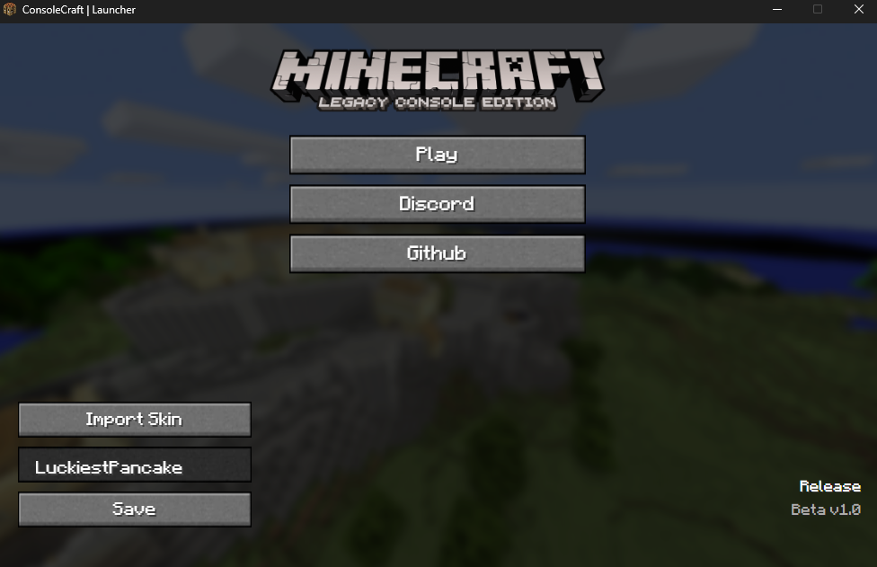

# ConsoleCraft Launcher

A Minecraft Legacy Console Edition Launcher, that tries to make everything easy to use and adds quality of life features!

# Features
- Custom GUI
- Usernames
- Skins
- Lightweight and simple

# Supported Platforms
- [X] Windows
- [X] Linux Wine
- [ ] Linux
- [ ] Mac OS

# To-Do
- [ ] Linux
- [ ] Mac OS
- [ ] Profile Menu
- [ ] Instances Menu

# From Source
1. `git clone https://github.com/LuckiestPancake/ConsoleCraft-Launcher.git` or just download it
2. `npm install` in the project directory
3. `npm start`

To build it just run `npm run dist`

# Developed
Created by LuckiestPancake, this launcher was built using Electron, HTML, CSS, and JavaScript.
Credits to **LegacyLauncher** for being an excellent resource while experimenting with and studying its source helped me learn how to implement features into my own launcher.
